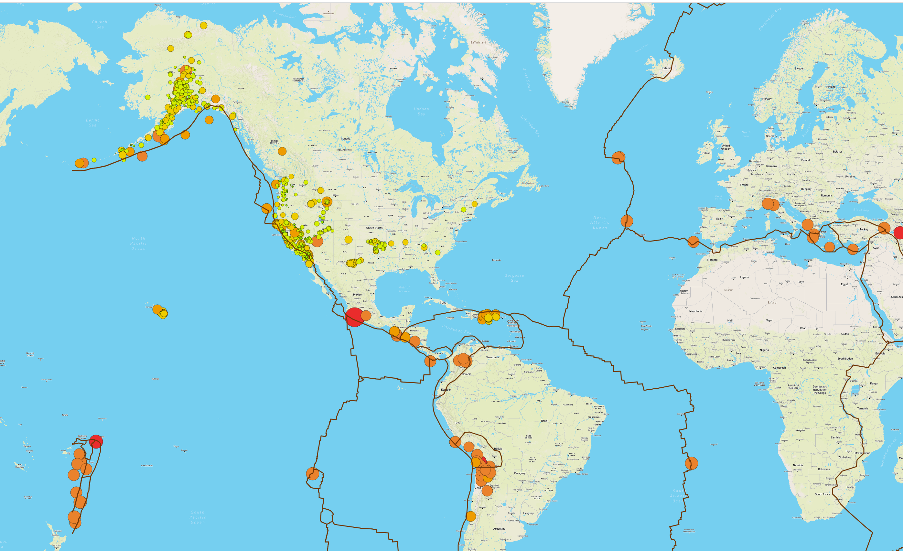

# Mapping_Earthquakes

## Overview of the Mapping Earthquakes Analysis

I just landed a role as a data visualization specialist with the Disaster Reporting Network, a non-profit that provides disaster reporting for journalists and data users.  We are tasked to build an interactive data visualization website for reporters and data visualization specialists that displays earthquake data for the last two weeks through API calls.  The website intends to draw a larger user base and educate more people about the pevalence of earthquakes.
 
### Resources

* Data Source:  index.html, tectonic_plate.js, major_earthquake.js
* Software:  JavaScript, Visual Studio Code
* Packages:  d3.json, geoJSON, LineString

## Mapping Earthquakes Results

### Deliverable #1

Add Tectonic Plate Data:

### Deliverable #2

Add Major Earthquake Data:

### Deliverable #3

Add Additional Map:

## Earthquake Analysis Code Snippets

challenge_logic.js:

index.html:

style.css:
